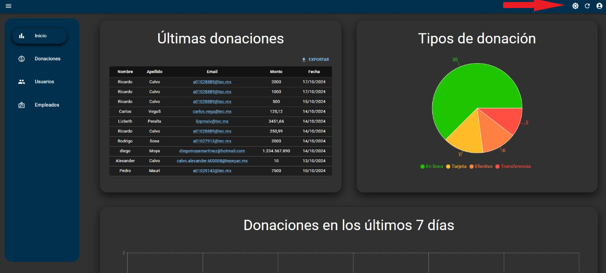
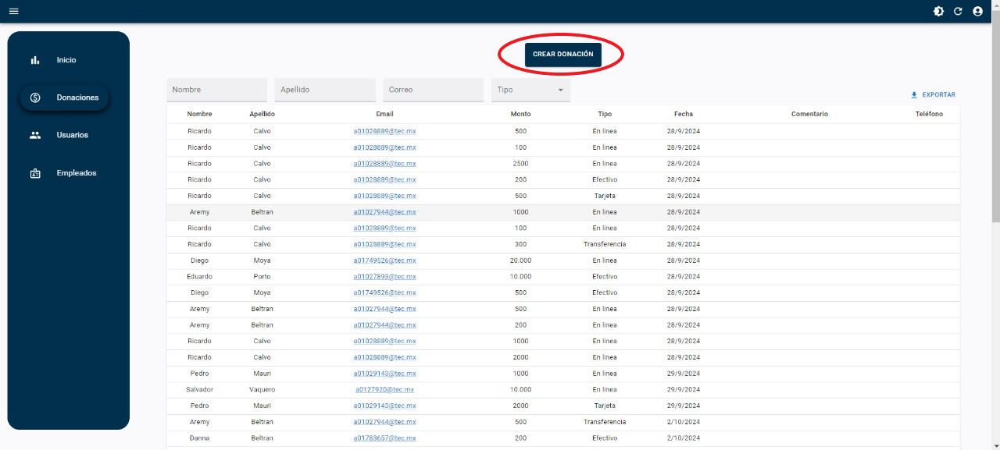
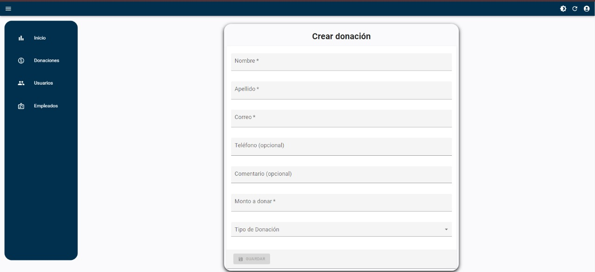
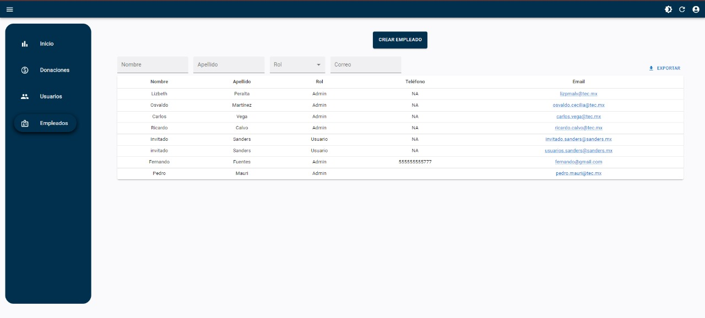
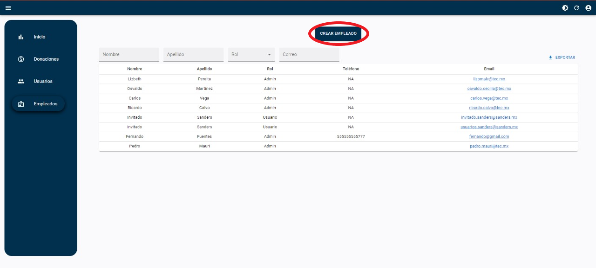
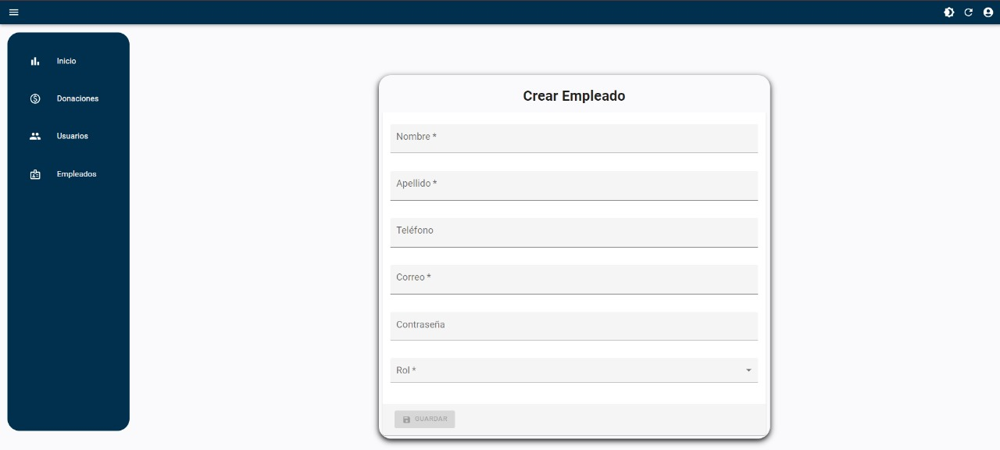
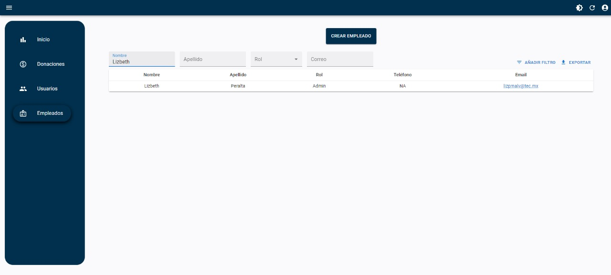

# **Manual de Usuario - Dashboard de Donaciones**

## **Índice**
1. [Inicio de Sesión y Donaciones como Invitado](#1-inicio-de-sesión-y-donacion-como-invitado)
2. [Pantalla al Seleccionar "Donar como Invitado"](#2-pantalla-al-seleccionar-donar-como-invitado)
3. [Logout](#3-logout)
4. [Inicio del Dashboard](#4-inicio-del-dashboard)
5. [Cambio de Contraste](#5-cambio-de-contraste)
6. [Dashboard de Donaciones](#6-dashboard-de-donaciones)
7. [Crear Donación en el Dashboard](#7-crear-donación-en-el-dashboard)
8. [Dashboard de Usuarios](#8-dashboard-de-usuarios)
9. [Dashboard de Empleados](#9-dashboard-de-empleados)
10. [Creación de Empleado](#10-creacion-de-empleado)
11. [Graficas](#11-graficas)
12. [Uso de Filtros en los dashboards](#12-uso-de-filtros-en-los-dashboards)

---

## 1. **Inicio de Sesión y Donacion como Invitado**
- **Descripción**: Esta pantalla permite a los usuarios iniciar sesión ingresando su **correo electrónico** y **contraseña**. También ofrece la opción de "Donar como invitado" sin tener que registrarse.
- **Acciones**:
  - Ingresar los campos requeridos para iniciar sesión.
  - Seleccionar "Donar como invitado" para realizar una donación sin iniciar sesión.

---

## 2. **Pantalla al Seleccionar "Donar como Invitado"**
- **Descripción**: Tras seleccionar la opción "Donar como invitado", esta pantalla permite a los usuarios realizar una donación ingresando el **nombre**, **apellido**, **correo**, y **monto a donar**.
- **Acciones**:
  - Completar los campos y hacer clic en "Guardar" para completar la donación.

---

## 3. **Logout**
- **Descripción**: Una vez iniciada la sesión, los usuarios pueden cerrar sesión desde el menú en la parte superior derecha del dashboard, donde aparece la opción "Logout".
- **Acciones**:
  - Hacer clic en el ícono de usuario y seleccionar "Logout" para cerrar sesión.
  

---

## 4. **Inicio del Dashboard**
- **Descripción**: Estas imágenes muestran el inicio del **dashboard**, con un resumen de las **últimas donaciones**, un gráfico de los **tipos de donación**, y una gráfica de las donaciones realizadas en los últimos 7 días.
- **Acciones**:
  - Consultar las últimas donaciones y los gráficos relacionados.

---

## 5. **Cambio de Contraste**
- **Descripción**: Dando click en este icono se hace cambio de contraste en todos los dashboards. Esta opción mejora la accesibilidad visual.
- **Acciones**:
  - Dar click al icono.

---

## 6. **Dashboard de Donaciones**
- **Descripción**: El dashboard de donaciones muestra una tabla con las donaciones realizadas, incluyendo información como el nombre del donante, apellido, correo electrónico, monto, tipo de donación, y fecha.
- **Acciones**:
  - Filtrar donaciones por nombre, apellido, correo, monto o tipo de donación.

---

## 7. **Crear Donación en el Dashboard**
- **Descripción**: Al hacer clic en "Crear Donación" dentro del dashboard de donaciones, se despliega un formulario para ingresar datos de una nueva donación.
- **Acciones**:
  - Llenar los campos requeridos y hacer clic en "Guardar" para registrar la donación.

---

## 8. **Dashboard de Usuarios**
- **Descripción**: El dashboard de usuarios muestra una tabla con los usuarios que han realizado donaciones, con información como nombre, apellido, correo electrónico, y número de donaciones.
- **Acciones**:
  - Filtrar usuarios por nombre, apellido o correo.

---

## 9. **Dashboard de Empleados**
- **Descripción**: Este dashboard muestra una lista de empleados registrados, con información como nombre, apellido, rol, y correo electrónico. También permite agregar nuevos empleados.
- **Acciones**:
  - Filtrar empleados por nombre, apellido, rol o correo.
  - Crear nuevos empleados utilizando el botón "Crear Empleado".
  

---

## 10. **Creacion de Empleado**
- **Descripción**: Al seleccionar "Crear Empleado", se despliega un formulario para agregar un nuevo empleado, con campos para el nombre, apellido, correo, contraseña, y rol.
- **Acciones**:
  - Ingresar los datos requeridos y hacer clic en "Guardar" para registrar al empleado.

  

---

## 11. **Graficas**
- **Descripción**: En el dashboard de inicio se muestran varias graficas:
  - Resumen de las últimas donaciones realizadas
  - Gráfico circular con los tipos de donación (en línea, tarjeta, efectivo, transferencia).
  - Número de donaciones realizadas en los últimos 7 días.
  - Usuarios que han hecho las mayores donaciones
  - Usuarios que han donado con mayor frecuencia.
 
- **Acciones**:
  - Consultar información general de las graficas.

  

---

## 12. **Uso de Filtros en los Dashboards**
- **Descripción**: Con estos botones se pueden aplicar filtros para buscar empleados por **nombre**, **apellido**, **rol**, o **correo**. El mismo sistema de filtros se puede utilizar en el apartado de **usuarios**.

- **Acciones**:
  - Aplicar filtros para buscar empleados o usuarios.

 
